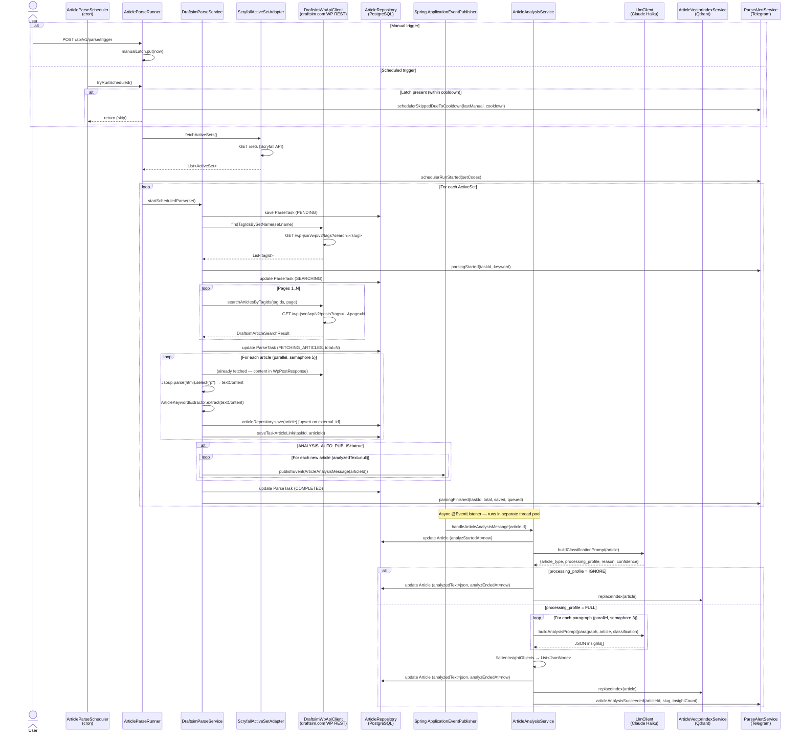

# draftsim-parser — CLAUDE.md

Spring Boot service that parses Draftsim articles using Spring AI for article analysis, embeddings, and semantic article search.

## Module Purpose

1. **Scrape**: Fetch article listings and content from `draftsim.com`
2. **Analyse**: Send article text through Spring AI chat → structured analysis
3. **Index**: Store analysis embeddings in Qdrant for semantic search
4. **Publish**: Store analysis results in DB; optionally auto-publish (`ANALYSIS_AUTO_PUBLISH`)

## Key Architecture

### AI abstraction

`LlmClient` is a domain port. Two implementations:
- `SpringAiLlmClient` — calls the configured Spring AI chat provider. Active when `infrastructure.llm.client=SPRING_AI` (production default).
- `MockLlmClient` — returns `null`, used for local testing without API key. Active when `infrastructure.llm.client=MOCK`.

Provider and model selection are environment-driven:
- `AI_CHAT_PROVIDER` / `AI_CHAT_MODEL` for article analysis
- `AI_EMBEDDING_PROVIDER` / `AI_EMBEDDING_MODEL` for vector indexing

Qdrant access is intentionally kept inside this service for now. It is wrapped behind the `ArticleVectorStore` port so it can later move to a separate vector service if multiple writers or shared schema ownership become real requirements.

### Layering

Same hexagonal pattern as other Spring modules:
- `application/rest` — controllers
- `application/service` — `ArticleAnalysisService` orchestrates scrape → analyse → persist
- `domain` — `Article`, `ArticleAnalysis`, `LlmClient` port
- `infrastructure/client/springai` — Spring AI chat wiring
- `infrastructure/vector` — Spring AI vector store adapter for Qdrant
- `infrastructure/client/draftsim` — HTTP scraper for draftsim.com
- `infrastructure/db` — Exposed tables + repositories

## Environment Variables

| Variable | Default | Required | Purpose |
|----------|---------|----------|---------|
| `DB_HOST` | — | Yes | PostgreSQL hostname |
| `DB_PORT` | — | Yes | PostgreSQL port |
| `DB_NAME` | — | Yes | Database name (`draftsim_parser_db`) |
| `DB_USERNAME` | — | Yes | PostgreSQL user |
| `DB_PASSWORD` | — | Yes | PostgreSQL password |
| `AUTH_ISSUER_URI` | — | Yes | Public URL of auth-service for JWKS validation |
| `DRAFTSIM_BASE_URL` | `https://draftsim.com` | No | Draftsim website base URL |
| `LLM_CLIENT` | `SPRING_AI` | No | `SPRING_AI` or `MOCK` |
| `AI_CHAT_PROVIDER` | `anthropic` | No | Spring AI chat provider |
| `AI_CHAT_MODEL` | `claude-haiku-4-5-20251001` | No | Chat model for article analysis |
| `ANTHROPIC_API_KEY` | — | Yes (if Anthropic chat) | Anthropic API key |
| `AI_EMBEDDING_PROVIDER` | `openai` | No | Spring AI embedding provider |
| `AI_EMBEDDING_MODEL` | `text-embedding-3-small` | No | Embedding model |
| `OPENAI_API_KEY` | — | Yes (if OpenAI embeddings) | OpenAI API key |
| `QDRANT_HOST` | `localhost` | No | Qdrant host |
| `QDRANT_PORT` | `6334` | No | Qdrant gRPC port |
| `QDRANT_API_KEY` | — | No | Qdrant API key if enabled |
| `QDRANT_COLLECTION` | `draftsim_article_insights_v1` | No | Versioned vector collection for article insights |
| `QDRANT_VECTOR_SIZE` | `1536` | No | Vector dimension used by `scripts/qdrant-migrate.py` |
| `QDRANT_DISTANCE` | `Cosine` | No | Vector distance used by `scripts/qdrant-migrate.py` |
| `ARTICLE_VECTOR_INDEX_ENABLED` | `true` | No | Enable Qdrant indexing and semantic search |
| `ARTICLE_VECTOR_SEARCH_CACHE_MAX_SIZE` | `500` | No | Max cached semantic search result sets |
| `ARTICLE_VECTOR_SEARCH_CACHE_TTL` | `PT10M` | No | Semantic search cache TTL |
| `ANALYSIS_AUTO_PUBLISH` | `false` | No | Auto-publish analysis results |
| `SCRYFALL_BASE_URL` | `https://api.scryfall.com` | No | Scryfall API base URL |
| `HTTP_CLIENT_SCRYFALL_RETRY_MAX_ATTEMPTS` | `3` | No | Retry attempts for Scryfall calls |
| `HTTP_CLIENT_SCRYFALL_RETRY_INITIAL_DELAY_MS` | `100` | No | Initial retry delay (ms) |
| `HTTP_CLIENT_SCRYFALL_RETRY_MULTIPLIER` | `2.0` | No | Backoff multiplier |
| `HTTP_CLIENT_SCRYFALL_RETRY_MAX_DELAY_MS` | `2000` | No | Max retry delay (ms) |
| `SCHEDULER_ARTICLE_PARSE_ENABLED` | `false` | No | Enable scheduled article parsing |
| `SCHEDULER_ARTICLE_PARSE_CRON` | `@daily` | No | Cron expression for article parse scheduler |
| `SCHEDULER_ARTICLE_PARSE_MANUAL_COOLDOWN` | `PT12H` | No | Cooldown after manual force-parse during which the cron scheduler skips auto-run |
| `ACTIVE_SETS_WINDOW_DAYS` | `365` | No | Days back to consider a set "active" |
| `ACTIVE_SETS_INCLUDE_DIGITAL` | `false` | No | Include digital-only sets |
| `TELEGRAM_ALERT_PER_ARTICLE_SUCCESS` | `false` | No | Send Telegram alert per successful article analysis |
| `TELEGRAM_ALERT_PER_ARTICLE_FAILURE` | `true` | No | Send Telegram alert per failed article analysis |

## Authentication

All REST endpoints (except `/actuator/health`, `/swagger-ui/**`, `/v3/api-docs/**`) require a valid JWT:

```
Authorization: Bearer <access_token>
```

The token is validated against JWKS lazily fetched from `AUTH_ISSUER_URI` on first request.
Obtain an access token from auth-service `POST /api/v1/auth/login` (see `auth-service/src/test/LOCAL_LOGIN.md`).

**Swagger UI**: use the `Authorize` button (`/swagger-ui.html`) to paste the access token.

**Security tests**: no `SecuritySmokeTest` exists yet — test infrastructure requires `ANTHROPIC_API_KEY` which is not available in CI without secrets.

## Database

`draftsim_parser_db` — created by `docker/postgres/init-databases.sh` on first PostgreSQL start.

Migrations: `src/main/resources/db/changelog/migrations/`

```bash
./gradlew :draftsim-parser:createMigration -PsqlName=add_new_table
./gradlew :draftsim-parser:update
```

## Qdrant Schema

Spring AI runtime schema initialization is disabled. Create or validate the Qdrant collection explicitly:

```bash
QDRANT_URL=http://localhost:6333 \
QDRANT_COLLECTION=draftsim_article_insights_v1 \
QDRANT_VECTOR_SIZE=1536 \
QDRANT_DISTANCE=Cosine \
AI_EMBEDDING_MODEL=text-embedding-3-small \
python3 scripts/qdrant-migrate.py
```

Do not change embedding dimensions in-place. If the embedding model changes dimension, create a new versioned collection such as `draftsim_article_insights_v2` and reindex articles.

## Integration Tests

Extend `AbstractIntegrationTest` (Testcontainers `postgres:16-alpine`). Required for SQL Mappers.
Services and controllers use unit tests with mocked dependencies.

## Article Parse Scheduler

Scheduled parsing of Draftsim articles for active MTG sets.

Enabled via `SCHEDULER_ARTICLE_PARSE_ENABLED=true`. Active sets are fetched from Scryfall `/sets` filtered by release window (`ACTIVE_SETS_WINDOW_DAYS`) and set types (expansion, core, draft_innovation, commander, masters by default).

For each active set, the scheduler looks up Draftsim WP tags matching the set name, then fetches articles tagged with those IDs. Keyword stored in `parse_tasks` is `set:<set_code>`.

Auto-publish respects `ANALYSIS_AUTO_PUBLISH` and only queues articles where `analyzed_text` is null (re-runs never re-analyze already processed articles).

Local test run:
```bash
SCHEDULER_ARTICLE_PARSE_ENABLED=true \
SCHEDULER_ARTICLE_PARSE_CRON='0 */2 * * * *' \
ANALYSIS_AUTO_PUBLISH=false \
./gradlew :draftsim-parser:bootRun
```

## Article Parsing Flow

### Overview

Two entry points share the same orchestration:
- **Scheduled** — `ArticleParseScheduler` fires on cron, delegates to `ArticleParseRunner.tryRunScheduled()`
- **Manual** — `POST /api/v1/parse/trigger` calls `ArticleParseRunner.triggerManual()`

`ArticleParseRunner` holds a **Caffeine cooldown latch**: after a manual trigger, `tryRunScheduled()` skips the next auto-run(s) for `SCHEDULER_ARTICLE_PARSE_MANUAL_COOLDOWN` (default `PT12H`). This prevents double-parsing when a user triggers manually before the nightly cron fires.

### Phase 1 — Scrape (DraftsimParseService)

1. **Resolve active sets** — `ScryfallActiveSetAdapter` calls `GET /sets` on Scryfall, filters by release window and set type
2. **Resolve WP tags** — for each set, `DraftsimWpApiClient` calls `GET /wp-json/wp/v2/tags?search=<set-slug>` and matches tags whose slug tokens are a superset of the set name tokens
3. **Fetch article listings** — paginated `GET /wp-json/wp/v2/posts?tags=<ids>` (headers `X-WP-Total` / `X-WP-TotalPages`)
4. **Fetch article content** — each `WpPostResponse.content.rendered` is the raw HTML of the post body
5. **Extract plain text** — Jsoup selects all `<p>` elements and joins them with `\n\n` → `textContent`
6. **Extract keywords** — TF-IDF via `ArticleKeywordExtractor` on `textContent`
7. **Upsert to DB** — `articleRepository.save()` upserts on `external_id`; existing rows keep their `analyzed_text` untouched
8. **Queue analysis** — if `ANALYSIS_AUTO_PUBLISH=true`, articles with `analyzed_text = null` are published as `ArticleAnalysisMessage` Spring events

### Phase 2 — Analyse (ArticleAnalysisService)

1. **Classification** — single LLM call with `buildClassificationPrompt(article)` → JSON `{article_type, processing_profile, reason, confidence}`; if `processing_profile = IGNORE` the article is marked done with empty insights
2. **Paragraph analysis** — `textContent` split on `\n\n`; each paragraph sent to LLM in parallel (coroutine `async(ioDispatcher)`, Semaphore of 3 concurrent calls); failures per paragraph are swallowed (`runCatching.getOrNull()`)
3. **Merge insights** — LLM responses parsed as JSON arrays/objects, flattened to `List<JsonNode>`
4. **Persist** — `analyzedText` stored as JSON string with schema:
   ```json
   {
     "schema_version": 2,
     "article_type": "draft_guide",
     "processing_profile": "full",
     "classification": { "reason": "...", "confidence": 0.95 },
     "keywords": ["..."],
     "insights": [{ ... }, { ... }]
   }
   ```
5. **Vector index** — `ArticleVectorIndexService` embeds the analysis JSON and upserts into Qdrant collection `draftsim_article_insights_v1`

### Sequence Diagram



### Key implementation files

| File | Role |
|------|------|
| `application/service/ArticleParseRunner.kt` | Orchestration entry point; holds cooldown latch |
| `application/scheduler/ArticleParseScheduler.kt` | Thin cron wrapper around `ArticleParseRunner` |
| `application/service/DraftsimParseService.kt` | Scrape loop: fetch → upsert → queue |
| `application/service/ArticleAnalysisService.kt` | LLM analysis pipeline per article |
| `application/service/ArticleAnalysisPromptBuilder.kt` | Classification and analysis prompt construction |
| `infrastructure/client/draftsim/DraftsimWpApiClient.kt` | WordPress REST API client + Jsoup HTML→text |
| `infrastructure/client/scryfall/ScryfallActiveSetAdapter.kt` | Scryfall sets API + filtering |
| `infrastructure/client/springai/SpringAiLlmClient.kt` | Spring AI chat client adapter |
| `infrastructure/vector/SpringAiArticleVectorStore.kt` | Qdrant embedding + upsert |
| `application/service/ParseAlertService.kt` | Telegram alerts for all parse events |
