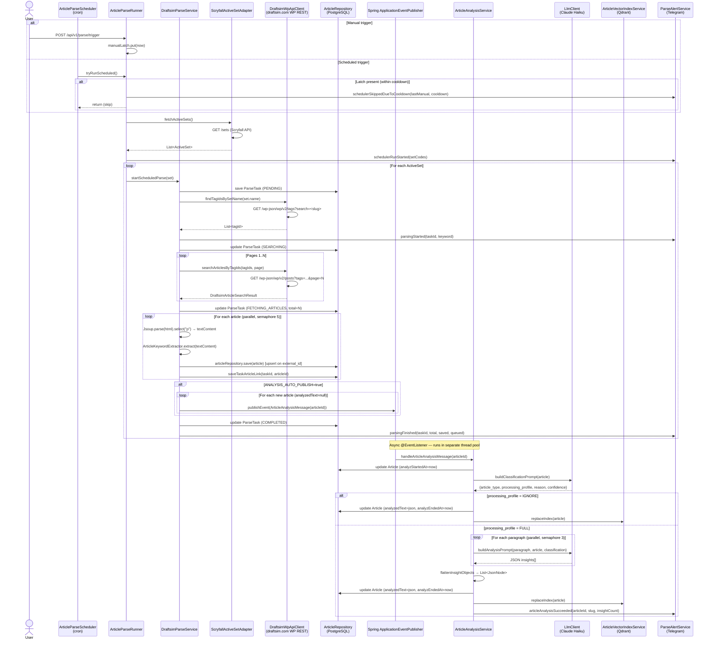

# Article Parsing Flow

## Overview

Two entry points share the same orchestration:
- **Scheduled** — `ArticleParseScheduler` fires on cron, delegates to `ArticleParseRunner.tryRunScheduled()`
- **Manual** — `POST /api/v1/parse/trigger` calls `ArticleParseRunner.triggerManual()`

`ArticleParseRunner` holds a **Caffeine cooldown latch**: after a manual trigger, `tryRunScheduled()` skips the next auto-run(s) for `SCHEDULER_ARTICLE_PARSE_MANUAL_COOLDOWN` (default `PT12H`). This prevents double-parsing when a user triggers manually before the nightly cron fires.

## Phase 1 — Scrape (DraftsimParseService)

1. **Resolve active sets** — `ScryfallActiveSetAdapter` calls `GET /sets` on Scryfall, filters by release window and set type
2. **Resolve WP tags** — for each set, `DraftsimWpApiClient` calls `GET /wp-json/wp/v2/tags?search=<set-slug>` and matches tags whose slug tokens are a superset of the set name tokens
3. **Fetch article listings** — paginated `GET /wp-json/wp/v2/posts?tags=<ids>` (headers `X-WP-Total` / `X-WP-TotalPages`)
4. **Fetch article content** — each `WpPostResponse.content.rendered` is the raw HTML of the post body
5. **Extract plain text** — Jsoup selects all `<p>` elements and joins them with `\n\n` → `textContent`
6. **Extract keywords** — TF-IDF via `ArticleKeywordExtractor` on `textContent`
7. **Upsert to DB** — `articleRepository.save()` upserts on `external_id`; existing rows keep their `analyzed_text` untouched
8. **Queue analysis** — if `ANALYSIS_AUTO_PUBLISH=true`, articles with `analyzed_text = null` are published as `ArticleAnalysisMessage` Spring events

## Phase 2 — Analyse (ArticleAnalysisService)

1. **Classification** — single LLM call with `buildClassificationPrompt(article)` → JSON `{article_type, processing_profile, reason, confidence}`; if `processing_profile = IGNORE` the article is marked done with empty insights
2. **Paragraph analysis** — `textContent` split on `\n\n`; each paragraph sent to LLM in parallel (coroutine `async(ioDispatcher)`, Semaphore of 3 concurrent calls); failures per paragraph are swallowed (`runCatching.getOrNull()`)
3. **Merge insights** — LLM responses parsed as JSON arrays/objects, flattened to `List<JsonNode>`
4. **Persist** — `analyzedText` stored as JSON string with schema:
   ```json
   {
     "schema_version": 2,
     "article_type": "draft_guide",
     "processing_profile": "full",
     "classification": { "reason": "...", "confidence": 0.95 },
     "keywords": ["..."],
     "insights": [{ ... }, { ... }]
   }
   ```
5. **Vector index** — `ArticleVectorIndexService` embeds the analysis JSON and upserts into Qdrant collection `draftsim_article_insights_v1`

## Sequence Diagram



## Key Implementation Files

| File | Role |
|------|------|
| `application/service/ArticleParseRunner.kt` | Orchestration entry point; holds cooldown latch |
| `application/scheduler/ArticleParseScheduler.kt` | Thin cron wrapper around `ArticleParseRunner` |
| `application/service/DraftsimParseService.kt` | Scrape loop: fetch → upsert → queue |
| `application/service/ArticleAnalysisService.kt` | LLM analysis pipeline per article |
| `application/service/ArticleAnalysisPromptBuilder.kt` | Classification and analysis prompt construction |
| `infrastructure/client/draftsim/DraftsimWpApiClient.kt` | WordPress REST API client + Jsoup HTML→text |
| `infrastructure/client/scryfall/ScryfallActiveSetAdapter.kt` | Scryfall sets API + filtering |
| `infrastructure/client/springai/SpringAiLlmClient.kt` | Spring AI chat client adapter |
| `infrastructure/vector/SpringAiArticleVectorStore.kt` | Qdrant embedding + upsert |
| `application/service/ParseAlertService.kt` | Telegram alerts for all parse events |
